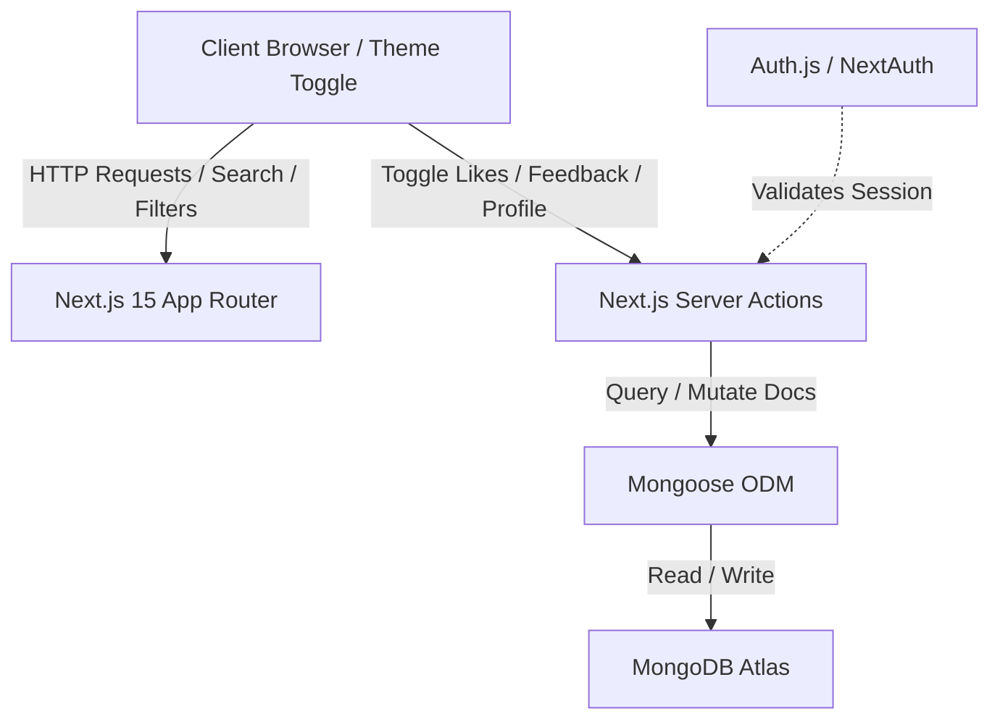

# ProjectHub 🚀

ProjectHub is a premium, production-ready project-sharing and discovery platform built for developers, designers, and students to showcase their work, gather constructive feedback, monitor views, and connect with other creators. It combines ideas from Product Hunt, GitHub, and Dev.to into a sleek, responsive workspace.

---

## 🛠️ Tech Stack

- **Core Framework**: [Next.js 15+](https://nextjs.org/) (App Router, App Directory, Server Actions, Route Handlers)
- **Runtime Library**: [React 19](https://react.dev/)
- **Programming Language**: [TypeScript](https://www.typescriptlang.org/)
- **Styling**: [Tailwind CSS](https://tailwindcss.com/)
- **Database Engine**: [MongoDB](https://www.mongodb.com/) via [Mongoose ORM](https://mongoosejs.com/)
- **Security & Session Auth**: [Auth.js (NextAuth.js v5 beta)](https://authjs.dev/) (GitHub OAuth & Google OAuth)
- **Deployment Platform**: [Vercel](https://vercel.com)

---

## 💎 Key Features

- 🔐 **Multi-Provider Authentication**: Secure GitHub and Google login with persistent Mongoose-backed author creation.
- 🎨 **Theme Toggle Support**: Smooth Light mode, Dark mode, and System mode toggles with page flash prevention (`next-themes`).
- 🧭 **Advanced Project Discovery**: Browsing route with category tabs, technology filtering, multi-field search queries, and MongoDB aggregate paginated pagination.
- 📝 **Markdown Detailed Descriptions**: Integration with `@uiw/react-md-editor` for rich submissions, compiled and safely displayed via `markdown-it`.
- 📊 **Real-time Analytics**: Counter for Project Views deduplicated via cookie hashes (24h lifespan) and interactive Project Likes with optimistic UI updates.
- 💬 **Constructive Feedback Thread**: Comment feeds supporting star ratings and deletion controls (restricted to comment author or project owner) with `revalidatePath` updates.
- 📈 **Creator Performance Dashboard**: Visual cards showing total views, total likes, drafts/published projects, recent activities stream, and an interactive CRUD table to view, edit, or delete projects.
- ⚙️ **Profile Settings**: Update name, bio, public email, avatar, GitHub URL, portfolio URL, and social accounts.
- 🔍 **SEO & Indexing**: Dynamic page titles, OG/Twitter metadata, dynamic `sitemap.xml` fetching database routes, and `robots.txt` compliance.

---

## 📐 Architecture & System Flow



---

## 🗄️ Database Structure

### Users / Creators (`Author`)
- `providerId` (String, Indexed): OAuth provider unique identifier.
- `provider` (String, enum: github, google): The OAuth source.
- `name` (String): Display name.
- `username` (String, Indexed): Slugified URL username.
- `email` (String, Indexed): User email.
- `image` (String): Avatar URL.
- `bio` (String): Short biography.
- `portfolio` (String): Portfolio link.
- `github` (String): GitHub profile.
- `twitter` (String): Twitter profile.
- `linkedin` (String): LinkedIn profile.

### Projects (`Project`)
- `title` (String, Required): Project name.
- `slug` (String, Unique, Indexed): URL slug.
- `description` (String, Required): Short description.
- `category` (String, Required): Project category.
- `coverImage` (String): Card image.
- `author` / `creator` (ObjectId, ref: Author, Indexed): Creator reference.
- `details` (String): Long Markdown description.
- `views` (Number, Default: 0, Indexed): View count.
- `likes` (Array of ObjectIds, ref: Author): Likes list.
- `technologies` (Array of Strings, Indexed): Stack tags.
- `githubUrl` (String): Repository URL.
- `liveUrl` (String): Live demo link.
- `documentationUrl` (String): Documentation link.
- `screenshots` (Array of Strings): Screenshot image URLs.
- `status` (String, enum: Draft, Published, Indexed): Visibility status.

### Feedback & Comments (`Feedback`)
- `name` (String): Reviewer name.
- `email` (String): Reviewer email.
- `message` (String, Required): Review message.
- `rating` (Number, 1-5): Rating stars.
- `user` (ObjectId, ref: Author, Indexed): Reviewer author reference.
- `project` (ObjectId, ref: Project, Indexed): Associated project.

---

## 🚀 Installation & Local Development

### Prerequisites
- Node.js 18+
- MongoDB Atlas cluster URL (or local MongoDB database)

### Setup Steps
1. **Clone and Install dependencies**:
   ```bash
   npm install
   ```

2. **Configure Environment Variables**:
   Copy `.env.example` into a new file named `.env.local`:
   ```bash
   cp .env.example .env.local
   ```
   Provide your MongoDB URI credentials and OAuth client secrets.

3. **Run Dev server**:
   Start development compilation with Next.js Turbopack:
   ```bash
   npm run dev
   ```

4. **Verify Build**:
   ```bash
   npm run build
   ```

---

## ⚙️ OAuth Configuration callback URLs

Configure callback redirects in your provider settings dashboards:
- **GitHub OAuth**: `https://<your-app>.vercel.app/api/auth/callback/github`
- **Google OAuth**: `https://<your-app>.vercel.app/api/auth/callback/google`

---

## 🔮 Future Improvements
- Add collaborative teams or co-author assignments on projects.
- Integrate direct GitHub API sync to pull repository stats, tags, and commits automatically.
- Support markdown upload images via Amazon S3 or Cloudinary.

<!-- TASKPLANNER:ATTRIBUTION:START -->
This project uses [TaskPlanner](https://github.com/smekai/taskplanner) for task planning.
<!-- TASKPLANNER:ATTRIBUTION:END -->
